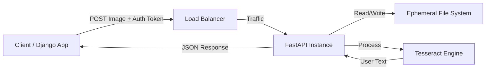

# FastAPI OCR Microservice

## 1. Project Overview

The **FastAPI OCR Microservice** is a proposed lightweight service designed to extract text from images using Optical Character Recognition (OCR). It is intended to serve as a high-performance utility component for the "Try Django 3.2" ecosystem.

Key planned capabilities:
- **Image-to-Text Conversion**: API to accept image uploads and return extracted text.
- **Image Echo**: Verification endpoint to echo back uploaded images.
- **Microservice Architecture**: To be designed for independent deployment and horizontal scaling.

## 2. Proposed Technical Stack

- **Language**: Python 3.8+
- **Framework**: FastAPI (selected for async capability and performance)
- **OCR Engine**: Tesseract (via `pytesseract` wrapper)
- **Server**: Uvicorn (ASGI) managed by Gunicorn.
- **Containerization**: Docker
- **Testing**: Pytest

## 3. High-Level Architecture (Proposed)

The system is designed to follow a synchronous request-response model, leveraging FastAPI's asynchronous capabilities for I/O bound operations.

## 4. Non-Functional Requirements

- **Scalability**: Stateless structure to allow horizontal scaling.
- **Security**: 
  - Token-based authentication (Bearer Schema).
  - Validation via Pydantic.
- **Performance**: 
  - Low-latency text extraction.
  - Non-blocking I/O for file uploads.

## 5. Intended Workflow

1. **Authentication**: Client provides `Authorization: Bearer <TOKEN>`.
2. **Upload**: Service streams image file to memory.
3. **Processing**: `pytesseract` processes the image buffer.
4. **Response**: Extracted text returned as JSON.

## 6. Project Status

**Current Phase: Design & Planning**

| Feature | Status | Notes |
| :--- | :--- | :--- |
| Core OCR Endpoint | 📅 Planned | `POST /` to be implemented. |
| Image Echo Endpoint | 📅 Planned | `POST /img-echo/` debugging tool. |
| Authentication | 📅 Planned | Shared Token logic. |
| Docker Support | 📅 Planned | `Dockerfile` to be created. |
| CI/CD | 📅 Planned | Initial setup pending. |

## 7. Documentation Index

- [System Design](./docs/system-design.md): Detailed proposed C4 models.
- [Architecture Decisions](./docs/architecture-decisions/): Agreed-upon design choices before implementation begins.
- [Challenges & Risks](./docs/challenges-and-risks.md): Anticipated technical risks.
- [Roadmap](./docs/future-improvements.md): Implementation plan and phases.
