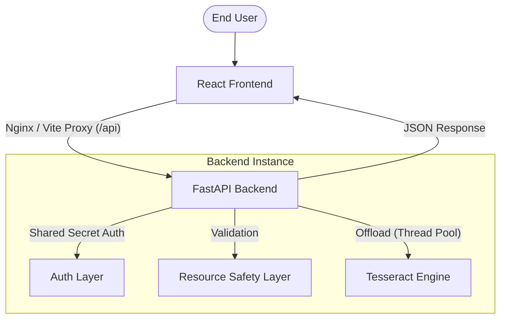

# FastAPI OCR Microservice

[](https://fastapi.tiangolo.com)
[](https://reactjs.org/)
[](https://www.docker.com/)
[](https://github.com/tesseract-ocr/tesseract)


A production-grade, high-performance microservice designed for extracting text from images using **Tesseract OCR**. Built with **FastAPI** and **React**, this service offers a robust, stateless architecture with strict resource safety and modern observability.

---

## 🚀 Getting Started

You can run the entire stack (Backend + Frontend) using Docker for an orchestrated experience, or manually for local development.

### 1. Orchestrated Setup (Recommended)
This method uses **Docker Compose** to spin up both the backend and frontend in a shared network. The frontend automatically proxies requests to the backend.

```bash
# 1. Clone the repository
git clone https://github.com/mo-hossam-stack/fastapi-ocr-microservice.git
cd fastapi-ocr-microservice

# 2. Configure environment
cp .env-example .env

# 3. Start the services
docker-compose up --build
```

- **Frontend**: [http://localhost:3000](http://localhost:3000)
- **Backend (API Docs)**: [http://localhost:8000/docs](http://localhost:8000/docs)

---

### 2. Local Development Setup
Use this method for debugging or making changes to individual components.

#### **Backend (FastAPI)**
```bash
# From repository root
cd app

# 1. Create and activate virtual environment
python -m venv venv
source venv/bin/activate  # Linux/macOS

# 2. Install dependencies
pip install -r ../requirements.txt

# 3. Setup environment
cp ../.env-example ../.env

# 4. Run the server
uvicorn main:app --reload --port 8000
```

#### **Frontend (React + Vite)**
```bash
# From repository root
cd frontend

# 1. Install dependencies
npm install

# 2. Start dev server
npm run dev
```
- **Frontend**: [http://localhost:5173](http://localhost:5173) (Proxies `/api` to port 8000 via Vite)

---

## 🛠 Technical Stack

### Backend
- **Core**: FastAPI (Python 3.12+)
- **OCR Engine**: Tesseract (via `pytesseract`)
- **Image Processing**: Pillow (PIL)
- **Validation**: Pydantic v2
- **Logging**: Structured JSON Logging

### Frontend
- **Framework**: React 18 + TypeScript
- **Styling**: Tailwind CSS
- **API Client**: Axios with Interceptors
- **Build Tool**: Vite

### Infrastructure
- **Containerization**: Docker (Multi-stage builds)
- **Proxy**: Nginx (Production) / Vite Proxy (Development)
- **Orchestration**: Docker Compose

---

## 🏗 System Architecture

The microservice follows a stateless architecture designed for horizontal scalability and resource isolation.



---

## 🛡️ Key Features & Engineering Rigor

- **Non-Blocking OCR**: Tesseract execution is offloaded to a thread pool (`run_in_executor`) to keep the FastAPI event loop responsive.
- **Resource Hardening**:
  - **10MB Content Limit**: Proactive validation via `Content-Length` and reactive validation during stream reading.
  - **30s Hard Timeout**: Prevents runaway OCR processes from saturating CPU.
- **Stateless Design**: No persistent cache or database required for core logic, enabling instant scaling.
- **Production Observability**: Structured JSON logging and built-in `/health` (Liveness) and `/ready` (Readiness) probes.
- **Security**: Shared secret authentication via Bearer tokens for internal service-to-service communication.

---

## 📊 Documentation Index

- [Architecture Decisions (ADRs)](./docs/architecture-decisions/): Logic behind the stack and design choices.
- [System Design](./docs/system-design.md): C4 models and request lifecycles.

---

## 🧪 Testing

The project maintains high test coverage using **Pytest**.

```bash
# Run all tests
pytest

# Run with integration tests (requires real Tesseract)
pytest -m integration
```

---
## 🤝 Contributing
Contributions are welcome! Please open issues or pull requests for bug fixes, enhancements, or new features.