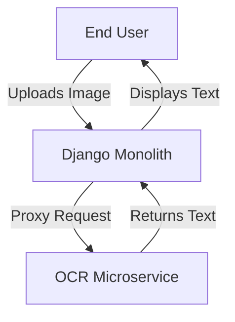
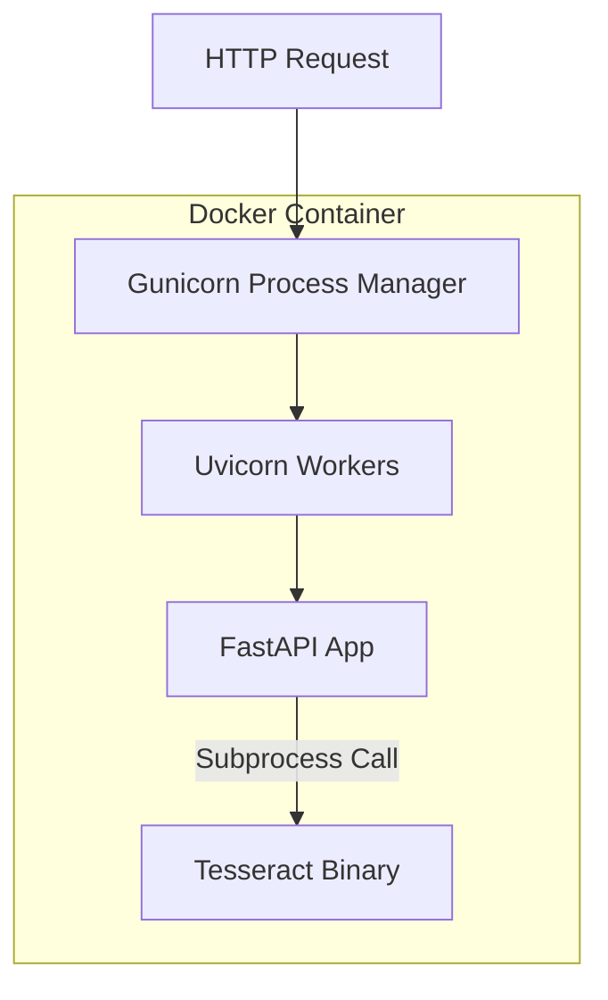

# System Design: FastAPI OCR Microservice (Proposed)

## 1. C4 Model

### 1.1 Context Diagram
The OCR Microservice is designed to support the primary Django application.

### 1.2 Container Diagram
The microservice will be self-contained within a Docker container.

### 1.3 Component Diagram (Main Application Strategy)
The application structure is planned as follows:

- **Auth Dependency**: A `verify_auth` dependency to secure the API.
- **Settings**: Use `pydantic` for environment variable management.
- **Views/Endpoints**:
  - `home_view`: Health check.
  - `prediction_view`: Core logic for Image -> Text.
  - `img_echo_view`: Debugging tool.

## 2. Request Lifecycle (Planned)

1. **Ingress**: Gunicorn/Uvicorn receives request.
2. **Middleware**: Auth check via Header.
3. **Validation**: Pydantic validates file type and size.
4. **Read**: Async file read to memory (`io.BytesIO`).
5. **Processing**: `pytesseract` called on the image object.
6. **Response**: JSON result.

## 3. Data Flow

- **Input**: Binary Image Data.
- **Processing**: In-Memory (PIL Image).
- **Ouput**: JSON Text.
- **Persistence**: Usage of ephemeral docker storage only; no database planned for Phase 1.

## 4. Scalability Strategy

The design relies on **statelessness**:
- **Vertical**: CPU allocation is key for Tesseract.
- **Horizontal**: Load balancing across multiple container replicas.

## 5. Authentication Design

- **Method**: Shared Secret (Bearer Token).
- **Reasoning**: Simple to implement for initial internal service communication.

## 6. Observability Plan

- **Logs**: Standard output logging (captured by Docker/Orchestrator).
- **Errors**: Standard HTTP 4xx/5xx responses with descriptive JSON detail.
